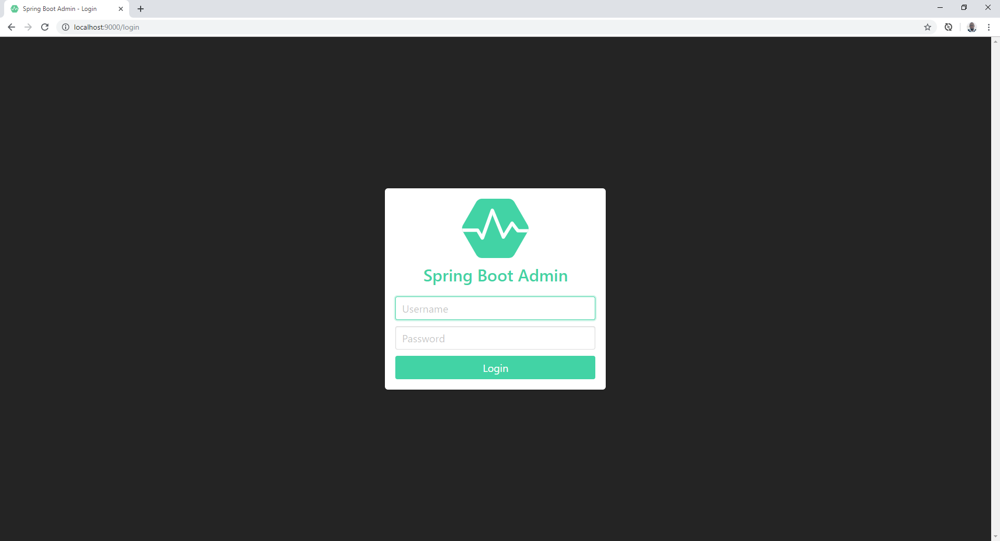
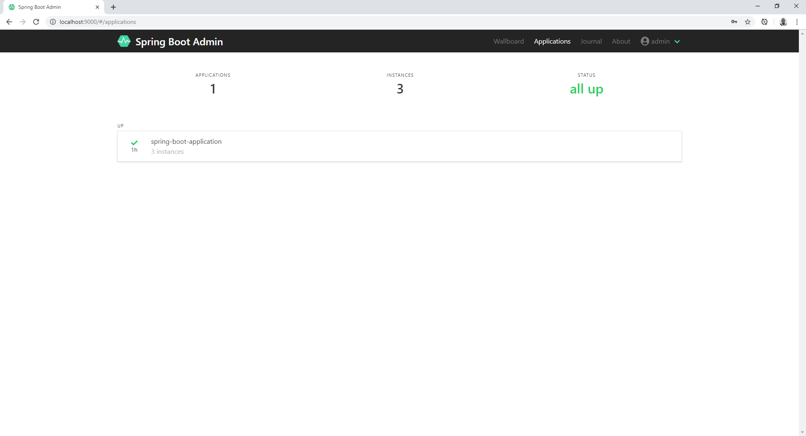
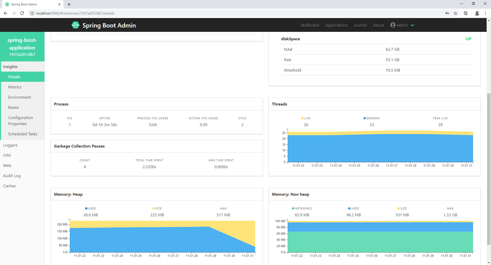
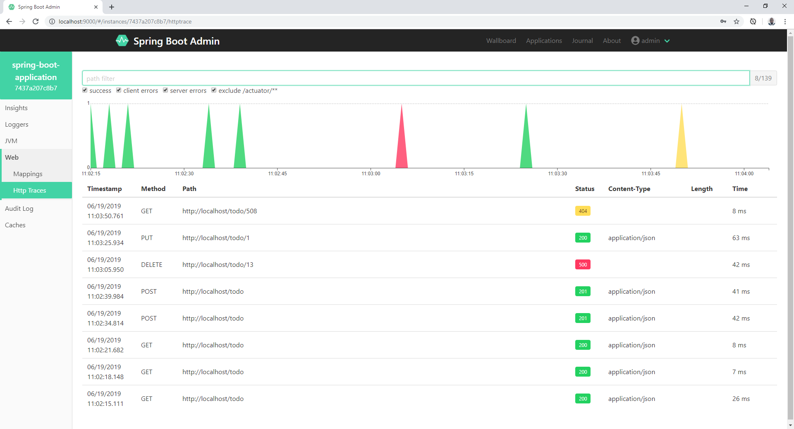

# Todo List API
Uma RESTFUL API simples que armazena e atualiza tarefas (TODO LIST API).

Esta aplicação usa NGINX como Load Balancer na frente de APIs REST criadas com Spring Boot (Tomcat embedded), PostgreSQL como Banco de Dados e Spring Boot Admin e Actuator para gerenciar e monitorar os serviços.
Todos os componentes são executados dentro de containers Docker.
Para exemplos de uso foi gerado cURL e Postman Collection.

## Architetura Overview


## How-to

### Requirements

Install <b>Docker</b>: https://docs.docker.com/engine/installation/

Install <b>docker-compose</b>: https://docs.docker.com/compose/install/

### Installation

Run the following commands:
  
```
$ git clone https://github.com/gilsonsf/todo-list.git
$ cd todo-list
$ sudo docker-compose up
```

### Acesso Spring Boot Admin

http://localhost:9000/ user:admin password:admin 

### Pode usar cURL ou Postman para acessar a aplicação

### Usando Postman Collection

[TODO-LIST-API.postman_collection.json](https://github.com/gilsonsf/todo-list/blob/master/client/TODO-LIST%20API.postman_collection.json)

### Usando cURL

#### Adiciona Tarefa
```
curl -X POST \
  http://localhost/todo \
  -H 'Content-Type: application/json' \
  -d '{
	"description": "Task To Do",
	"status": "PENDING"
}'
```

#### Busca Tarefa
```
curl -X GET http://localhost/todo/1
```

#### Busca Todas Tarefas
```
curl -X GET http://localhost/todo
```

#### Deleta Tarefa
```
curl -X DELETE  http://localhost/todo/1
```

#### Altera Tarefa
```
curl -X PUT \
  http://localhost/todo/1 \
   -H 'Content-Type: application/json' \
  -d '{
	"description": "Task Done",
	"status": "COMPLETED"
}'
```

### Captura de Telas

Login 

Dashboard 

Detail 

HTTP Trace 

## Tecnologias
- [Spring Boot](https://spring.io/projects/spring-boot)

- [Spring Boot Admin] (https://github.com/codecentric/spring-boot-admin)

- [Docker](https://www.docker.com/)

- [Nginx](https://www.nginx.com/)

- [PostgresSQL](https://www.postgresql.org/)

- [Java](www.java.com)

- [Maven](https://maven.apache.org/)

- [JUnit](https://junit.org/)

- [Mockito](https://site.mockito.org/)
